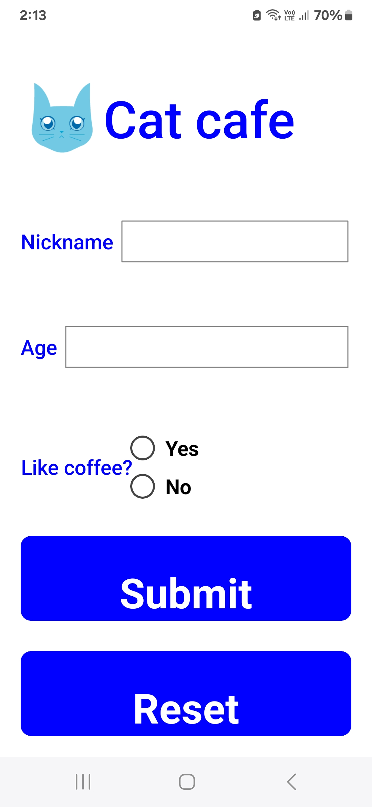
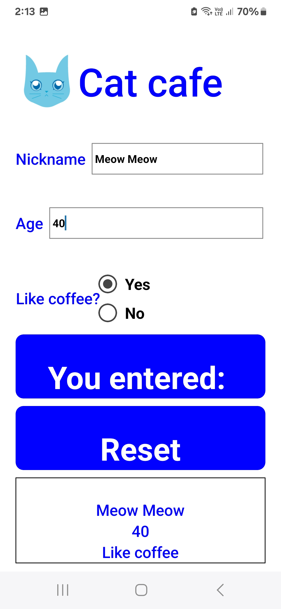

# REAMDE

React Native: Assignment 1

Explanation:
- Nicname: enter the name
- Age: enter the age
- Like coffee: select "Yes" or "No"
- Submit: Submit the form
- Reset: Clear the details from the form

# Screenshot

Starting screen:



After details are entered and submitted:




## Cloning

After cloning, install the packages: 

```
npm install
```


## New packages

```
npx expo install react-native-safe-area-context

npm install react-native-safe-area-context

```